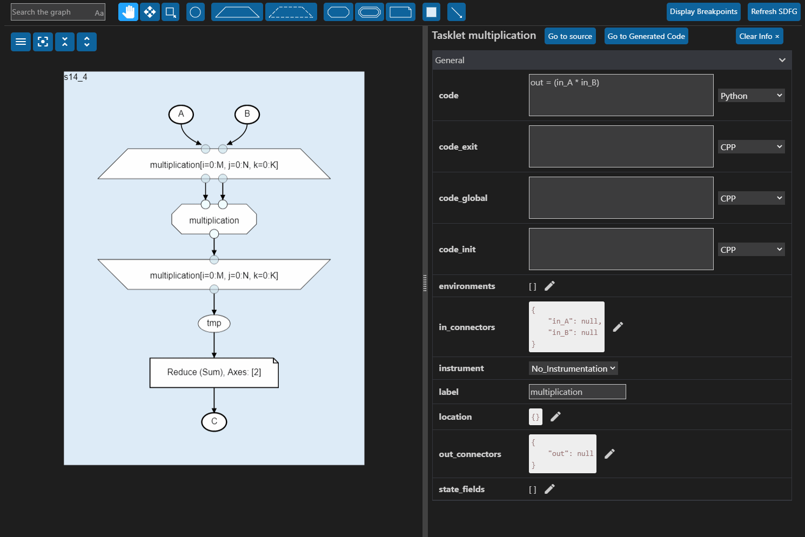
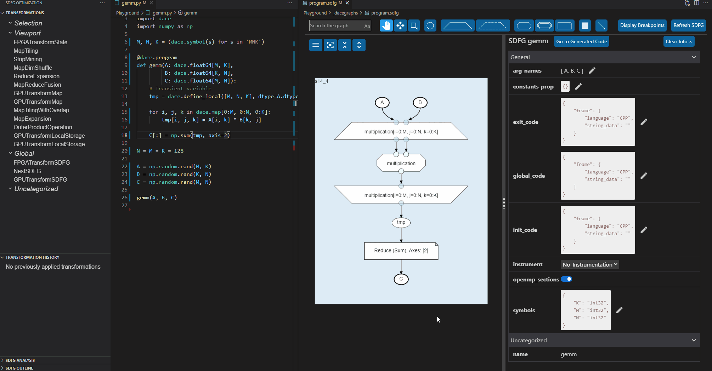
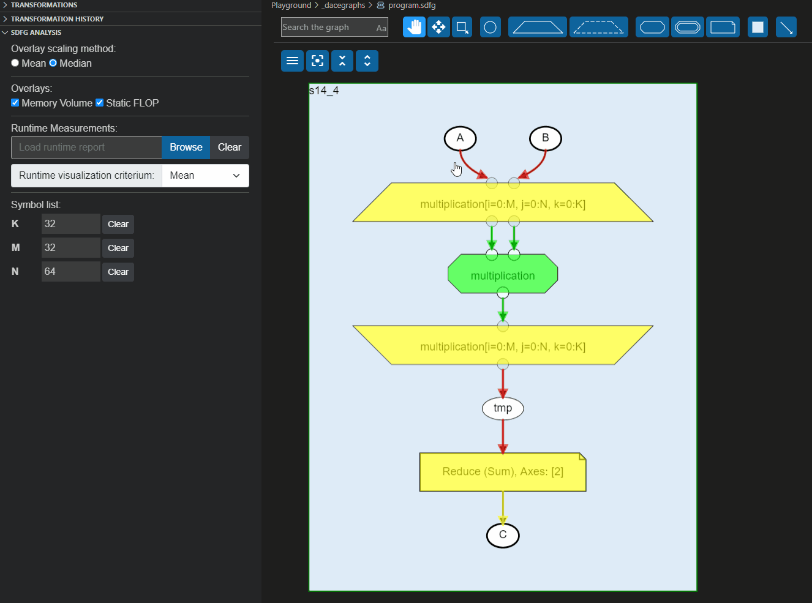
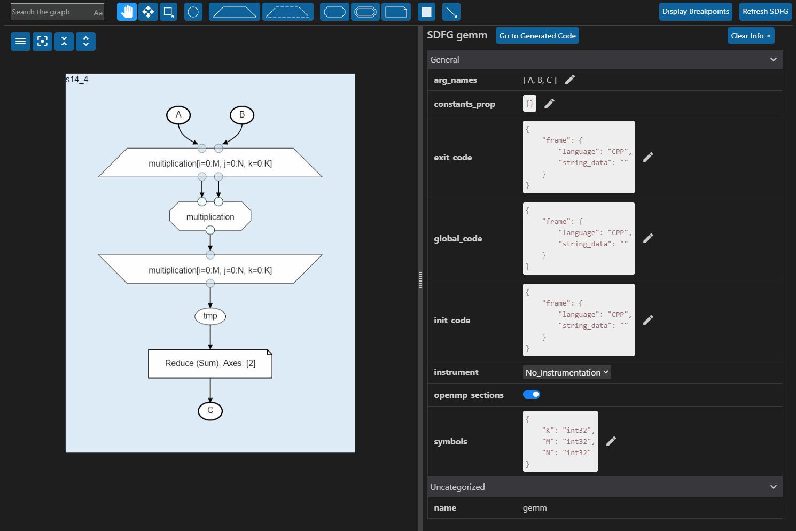

# DaCe SDFG Editor for Visual Studio Code

This Visual Studio Code extension provides a rich editor for
[SDFGs](http://spcl.inf.ethz.ch/dace/) with included profiling and
debugging, static analysis, and interactive optimization.

# Features

## SDFG Editor

The SDFG editor allows changing of all editable SDFG properties and elements.
To allow for easier exploration of large graphs, most graph elements can be
collapsed into a smaller, more compact representation. A number of viewing
options, like the hiding of access nodes, can further assist with the editing
of larger graphs.

## SDFG Optimization / Transformations

With the SDFG Editor, data-centric applications can be optimized interactively using transformations.

- A set of applicable performance optimizing transformations is shown in a
  sorted list in the side panel for each valid SDFG program.
- A description provides more information about each transformation.
- Transformations can be previewed before applying them to the SDFG.
- The transformation history allows easy undoing/redoing of specific
  optimization steps.

 

## Static Analysis

SDFGs can be statically analyzed for memory or compute bottlenecks using a
series of overlays, which highlight the number of arithmetic operations or the
amount of memory moved per graph element.

## Profiling

A built-in profiling run configuration allows SDFG programs to be run multiple
times1 while recording the median runtime for each execution. This
median runtime is then reported back to you. Additionally, individual graph
elements can be instrumented with timers, which generates a detailed profiling
report after an SDFG's execution. This report can be loaded in an displayed via
overlay on top of the SDFG.

1 The number of executions per profiling run can be configured in
the `.dace.config`. This can be opened by typing `Open .dace.config` into the
command bar.

## Building SDFGs

Graph elements can be dynamically added and moved around, allowing the creation
of entire SDFGs from scratch.

## Debugging

SDFGs can be run with a debugger, allowing the setting of breakpoints on the
graph. For this purpose, the extension will install the
[Python / C++ Debugger](https://marketplace.visualstudio.com/items?itemName=benjamin-simmonds.pythoncpp-debug)
extension.

# Questions, Issues, Feature Requests, and Contributions

If you have questions about how to achieve something with the extension, want
to report an issue, or request a new feature, please use the
[issues page](https://github.com/spcl/dace-vscode/issues) on GitHub.
Contributions are always welcome!
